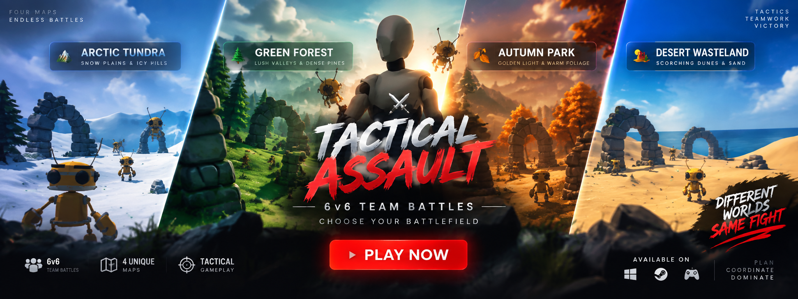

<div align="center">
  
</div>

# 🎯 Tactical Assault

    

A high-performance, web-based 3D tactical shooter built from the ground up using **Three.js** for rendering and an **AssemblyScript/WebAssembly (WASM)** engine for core game logic.

## ✨ Features

- **3D Graphics & Rendering**: Powered by Three.js for immersive, in-browser graphics.
- **High-Performance WASM Engine**: Game physics and core mechanics are handled by a custom WebAssembly engine compiled from AssemblyScript (`engine.wasm`), ensuring near-native performance.
- **Multiple Weapons**: Features an arsenal including AK-47, Pistol, Railgun, Rocket Launcher, and SMG with custom sounds and skins.
- **Dynamic Assets**: Utilizes `.glb` 3D models for characters (Xbot, RobotExpressive) and environment obstacles.
- **Fast Build System**: Uses Vite for lightning-fast Hot Module Replacement (HMR) and optimized production builds.

## 🚀 Getting Started

### Prerequisites
Make sure you have Node.js and a package manager like `npm` or `bun` installed.

### Installation

1. Clone the repository:
   ```bash
   git clone https://github.com/rajeshc-git/tactical-assault.git
   cd tactical-assault
   ```
2. Install the dependencies:
   ```bash
   npm install
   # or
   bun install
   ```

### Running Locally

Start the Vite development server:
```bash
npm run dev
# or
bun run dev
```
The game will be available at `http://localhost:5173` (or the port specified in your terminal).

### Building for Production

To create an optimized production build:
```bash
npm run build
# or
bun run build
```
The built files will be output to the `dist/` directory.

## 🛠️ Tech Stack

- **Graphics**: [Three.js](https://threejs.org/)
- **Logic Engine**: [AssemblyScript](https://www.assemblyscript.org/) (compiles to WebAssembly)
- **Language**: [TypeScript](https://www.typescriptlang.org/)
- **Bundler**: [Vite](https://vitejs.dev/)

## 🎮 Assets & Sounds
The game includes custom weapon skins, sound effects (firing, reloading), and high-quality 3D models located in the `public/assets/` directory.

---
*Developed as part of the Tactical Assault project.*
